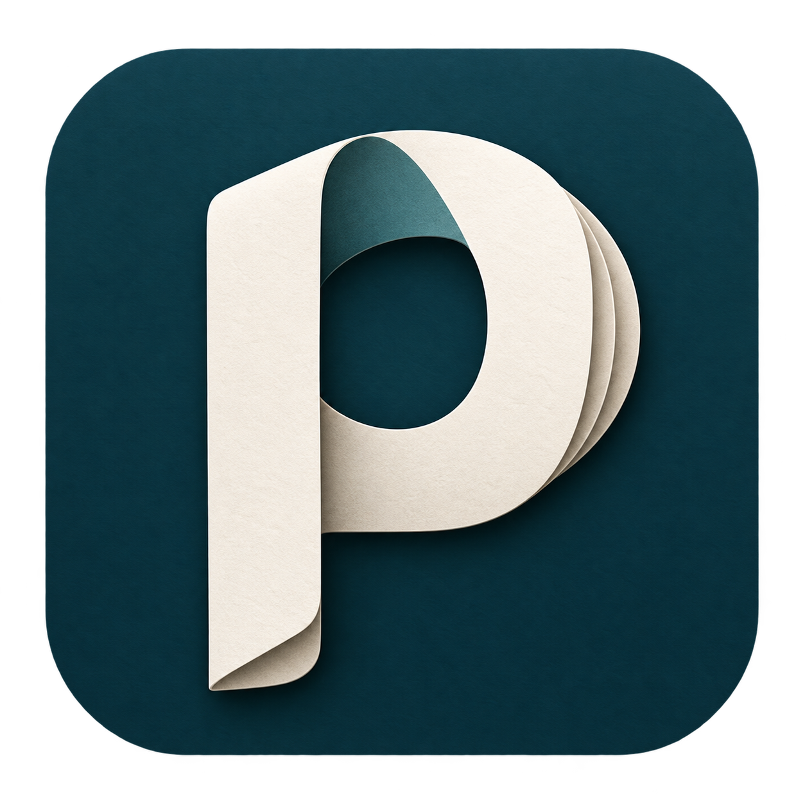

<div align="center">

<br>


<h1>paper-craft</h1>
<p><strong>Research writing skills learned from strong papers.</strong></p>
<p><sub>22 SPECIALISTS &nbsp; / &nbsp; 8 CONFERENCES &nbsp; / &nbsp; 10+ PAPERS PER SPECIALIST</sub></p>

<p>
  <a href="#get-started">Get started</a> ·
  <a href="#specialist-library">Browse skills</a> ·
  <a href="#a-small-example">Writing example</a> ·
  <a href="#contribute-a-skill">Contribute</a>
</p>

<br>
</div>

---

Turn an idea, rough draft, or set of results into a paper with a clear story. paper-craft distills how published papers introduce a problem, make an insight memorable, organize experiments, explain findings, and write precise, natural English.

Each skill focuses on a **conference and research area**, drawing on at least **10 papers accepted at that conference**. The lessons come with paper references and concrete writing examples.

## What it helps you write

| Part of the paper | What the skill helps you do |
|:---|:---|
| **Story & contribution** | Find the central insight and make its value clear. |
| **Title & abstract** | Make the contribution recognizable without inflated language. |
| **Introduction & method** | Connect the problem, intuition, and design. |
| **Experiments & results** | Organize around questions and explain what the findings mean. |
| **Sentences & paragraphs** | Replace awkward words, vague claims, and overloaded paragraphs with clear prose. |

## Get started

**1. Clone the repository.**

```bash
git clone https://github.com/ulairii/paper-craft.git
```

**2. Give your assistant the entry point and your material.**

```text
Read paper-craft/skills/paper-craft/SKILL.md.

I am submitting to ICLR. Write a full paper draft from my method and
existing experiment results. Find the central story, explain the important
comparisons, and use plain academic English.

[Paste your method and results, or provide their file paths]
```

Use the path to your clone if you are working elsewhere. The assistant reads your material, selects the appropriate conference-and-subfield skill, and writes the requested draft. You can also ask for a single section, an outline, or a sentence edit.

### Install in a skills-compatible assistant

If your assistant supports installing skills from folders, copy **all folders inside `skills/` together** into its configured skills location, preserving their names and `references/` directories. Invoke the `paper-craft` entry point using your assistant's supported invocation method. The entry point uses relative paths to load the specialists; copying only its folder provides general guidance but omits the specialist content.

The skill is a collection of Markdown instructions and reading notes. Using it requires no paper downloads, Python environment, API keys, or access to the author's machines.

### How skill selection works

[paper-craft](skills/paper-craft/SKILL.md) uses a [catalog](skills/paper-craft/references/catalog.md) to match the target conference, central research topic, and writing task. It infers the topic from the supplied work rather than asking you to choose a directory.

If the work spans several areas, it chooses one primary skill and draws on another only where useful. If no specialist fits, it continues with general writing guidance and briefly notes the coverage gap. An ICLR target alone does not cause every paper to be treated as LLM reasoning.

The entry point must be loaded or installed in your assistant; cloning a repository alone does not activate it.

## Specialist library

Choose a research family below, or let the [entry point](skills/paper-craft/SKILL.md) select a specialist from your material. Each **Papers** link opens the cited collection and individual reading notes. For detailed topic coverage, see the [routing catalog](skills/paper-craft/references/catalog.md).

[AI & machine learning](#ai--machine-learning) · [Computer vision](#computer-vision) · [Security & privacy](#security--privacy)

### AI & machine learning

From learning objectives and model design to reasoning, generation, and control.

| Conference | Writing skill | References |
|:---|:---|:---|
| **ICLR** | [LLM reasoning and test-time compute](skills/paper-craft-iclr-reasoning/SKILL.md) | [Papers · 2023–2025](skills/paper-craft-iclr-reasoning/references/corpus.md) |
| **ICLR** | [Representation learning](skills/paper-craft-iclr-representation/SKILL.md) | [Papers · 2019–2022](skills/paper-craft-iclr-representation/references/corpus.md) · [BibTeX](skills/paper-craft-iclr-representation/references/references.bib) |
| **ICLR** | [Generative models](skills/paper-craft-iclr-generative/SKILL.md) | [Papers · 2014–2024](skills/paper-craft-iclr-generative/references/corpus.md) · [BibTeX](skills/paper-craft-iclr-generative/references/references.bib) |
| **ICML** | [Representation learning](skills/paper-craft-icml-representation/SKILL.md) | [Papers · 2020–2023](skills/paper-craft-icml-representation/references/corpus.md) · [BibTeX](skills/paper-craft-icml-representation/references/references.bib) |
| **ICML** | [Generative models](skills/paper-craft-icml-generative/SKILL.md) | [Papers · 2014–2023](skills/paper-craft-icml-generative/references/corpus.md) · [BibTeX](skills/paper-craft-icml-generative/references/references.bib) |
| **ICML** | [Reinforcement learning](skills/paper-craft-icml-rl/SKILL.md) | [Papers · 2015–2022](skills/paper-craft-icml-rl/references/corpus.md) · [BibTeX](skills/paper-craft-icml-rl/references/references.bib) |
| **NeurIPS** | [Representation learning](skills/paper-craft-neurips-representation/SKILL.md) | [Papers · 2019–2022](skills/paper-craft-neurips-representation/references/corpus.md) · [BibTeX](skills/paper-craft-neurips-representation/references/references.bib) |
| **NeurIPS** | [Generative models](skills/paper-craft-neurips-generative/SKILL.md) | [Papers · 2014–2022](skills/paper-craft-neurips-generative/references/corpus.md) · [BibTeX](skills/paper-craft-neurips-generative/references/references.bib) |
| **NeurIPS** | [Reinforcement learning](skills/paper-craft-neurips-rl/SKILL.md) | [Papers · 2017–2021](skills/paper-craft-neurips-rl/references/corpus.md) · [BibTeX](skills/paper-craft-neurips-rl/references/references.bib) |

### Computer vision

Detection, segmentation, and 3D perception, with lessons specific to each venue.

| Conference | Writing skill | References |
|:---|:---|:---|
| **CVPR** | [Object detection](skills/paper-craft-cvpr-detection/SKILL.md) | [Papers · 2014–2022](skills/paper-craft-cvpr-detection/references/corpus.md) · [BibTeX](skills/paper-craft-cvpr-detection/references/references.bib) |
| **CVPR** | [Segmentation](skills/paper-craft-cvpr-segmentation/SKILL.md) | [Papers · 2015–2023](skills/paper-craft-cvpr-segmentation/references/corpus.md) · [BibTeX](skills/paper-craft-cvpr-segmentation/references/references.bib) |
| **CVPR** | [3D perception](skills/paper-craft-cvpr-3d/SKILL.md) | [Papers · 2017–2024](skills/paper-craft-cvpr-3d/references/corpus.md) · [BibTeX](skills/paper-craft-cvpr-3d/references/references.bib) |
| **ICCV** | [Object detection](skills/paper-craft-iccv-detection/SKILL.md) | [Papers · 2015–2023](skills/paper-craft-iccv-detection/references/corpus.md) · [BibTeX](skills/paper-craft-iccv-detection/references/references.bib) |
| **ICCV** | [Segmentation](skills/paper-craft-iccv-segmentation/SKILL.md) | [Papers · 2015–2023](skills/paper-craft-iccv-segmentation/references/corpus.md) · [BibTeX](skills/paper-craft-iccv-segmentation/references/references.bib) |
| **ICCV** | [3D perception](skills/paper-craft-iccv-3d/SKILL.md) | [Papers · 2019–2023](skills/paper-craft-iccv-3d/references/corpus.md) · [BibTeX](skills/paper-craft-iccv-3d/references/references.bib) |
| **ECCV** | [Object detection](skills/paper-craft-eccv-detection/SKILL.md) | [Papers · 2018–2024](skills/paper-craft-eccv-detection/references/corpus.md) · [BibTeX](skills/paper-craft-eccv-detection/references/references.bib) |
| **ECCV** | [Segmentation](skills/paper-craft-eccv-segmentation/SKILL.md) | [Papers · 2018–2024](skills/paper-craft-eccv-segmentation/references/corpus.md) · [BibTeX](skills/paper-craft-eccv-segmentation/references/references.bib) |
| **ECCV** | [3D perception](skills/paper-craft-eccv-3d/SKILL.md) | [Papers · 2018–2024](skills/paper-craft-eccv-3d/references/corpus.md) · [BibTeX](skills/paper-craft-eccv-3d/references/references.bib) |

### Security & privacy

Software testing, privacy measurement, and the security of learning systems.

| Conference | Writing skill | References |
|:---|:---|:---|
| **IEEE S&P** | [Software security](skills/paper-craft-sp-software/SKILL.md) | [Papers · 2017–2022](skills/paper-craft-sp-software/references/corpus.md) · [BibTeX](skills/paper-craft-sp-software/references/references.bib) |
| **USENIX Security** | [Software security](skills/paper-craft-usenix-software/SKILL.md) | [Papers · 2018–2020](skills/paper-craft-usenix-software/references/corpus.md) · [BibTeX](skills/paper-craft-usenix-software/references/references.bib) |
| **USENIX Security** | [Privacy and measurement](skills/paper-craft-usenix-privacy/SKILL.md) | [Papers · 2017–2022](skills/paper-craft-usenix-privacy/references/corpus.md) · [BibTeX](skills/paper-craft-usenix-privacy/references/references.bib) |
| **USENIX Security** | [Machine learning security](skills/paper-craft-usenix-ml/SKILL.md) | [Papers · 2018–2022](skills/paper-craft-usenix-ml/references/corpus.md) · [BibTeX](skills/paper-craft-usenix-ml/references/references.bib) |

## A small example

An abstract opening that hides the idea:

> We propose a novel and effective two-stage reinforcement learning framework to enhance the self-correction capabilities of large language models.

A more informative opening:

> A model that revises its answer must learn both when to change it and what to change. We train these behaviors in two stages: first improving revision, then jointly optimizing the initial answer and its correction.

The second version gives the reader a problem and a design rationale before introducing the machinery. This is an original writing illustration inspired by SCoRe, not a quotation from the paper. The [full worked example](skills/paper-craft-iclr-reasoning/references/worked-example.md) develops the introduction, method, and experiment story.

## Explore the writing lessons

- [Story and section structure](skills/paper-craft-iclr-reasoning/references/writing-playbook.md)
- [Plain English, terminology, and paragraph flow](skills/paper-craft-iclr-reasoning/references/claim-language.md)
- [Experiments that tell the story](skills/paper-craft-iclr-reasoning/references/experiment-playbook.md)
- [Example requests](examples/prompts.md)
- [Paper-by-paper reading notes](skills/paper-craft-iclr-reasoning/references/corpus.md)

## Contribute a skill

Choose a conference and a focused research area. Read at least 10 accepted papers from that conference and distill their writing choices: how the story starts, where the insight appears, how experiments advance the argument, and which details help the reader. Include source locations and original before/after examples, rather than a list of generic writing tips.

Keep the `SKILL.md` practical and put deeper analysis in `references/`. Explain what makes the papers persuasive; acceptance alone cannot establish which writing choices caused it.

Add the new folder alongside the existing skills and register it in the [catalog](skills/paper-craft/references/catalog.md), including its conference, topic signals, supported writing tasks, and distinctions from neighboring topics. Keep specialist directories together on the same Git branch. Users continue to call `paper-craft` as the collection grows.

The collection is expanding across AI, computer vision, and security, including further S&P topics, CCS, and NDSS. The [specialist library](#specialist-library) lists the skills you can use today.
